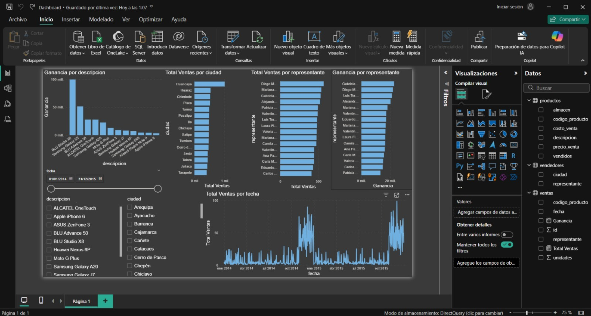

# Análisis de Ventas de Teléfonos en Perú – SQL + Power BI

Este proyecto analiza datos de ventas de teléfonos en tiendas peruanas mediante SQL y Power BI. Se diseñó un flujo completo desde la carga de datos hasta visualizaciones interactivas en tiempo real.

## Tecnologías
- SQL Server
- Power BI (modo DirectQuery)
- Microsoft SSIS (Importación de datos)
- GitHub

## Estructura de Datos
- `ventas`: Información de ventas (fecha, producto, vendedor, unidades)
- `productos`: Catálogo de teléfonos (modelo, precio, costo, vendidos)
- `vendedores`: Vendedores y su ciudad

## Análisis Realizados
- Ventas totales por ciudad
- Ganancia por producto
- Evolución de ventas mensual
- Ranking de representantes por ventas

## Dashboard Power BI
Incluye:
- KPIs (Ventas totales, Ganancia total)
- Gráfico de barras por ciudad
- Línea temporal de ventas
- Tabla dinámica por producto

## Aprendizajes
- Importación y validación de datos con SSIS
- Creación de claves foráneas y relaciones en SQL
- Uso de DirectQuery para mantener el dashboard actualizado
- Modelado de datos en Power BI

---

**Demo del Dashboard (imagen):**

---

## Contacto
Proyecto creado por [Marko Naveda](https://www.linkedin.com/in/marko-alexander-naveda-samame-721aa9264/)